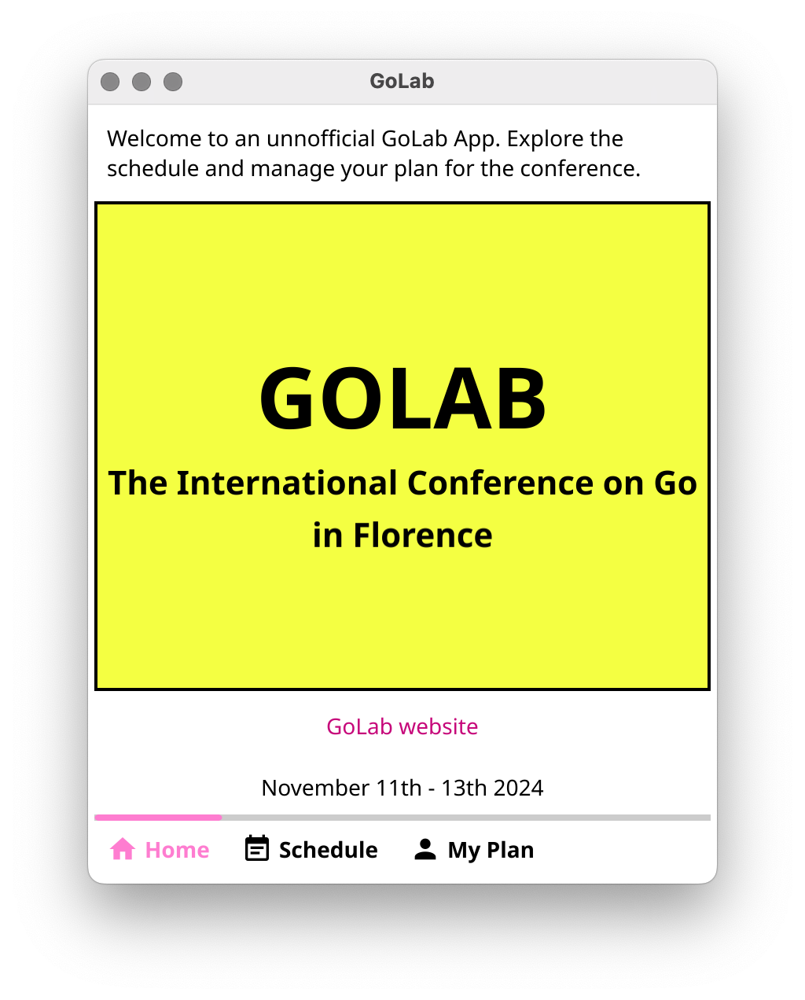
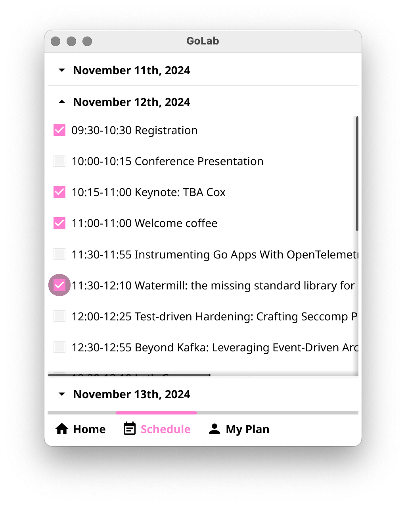
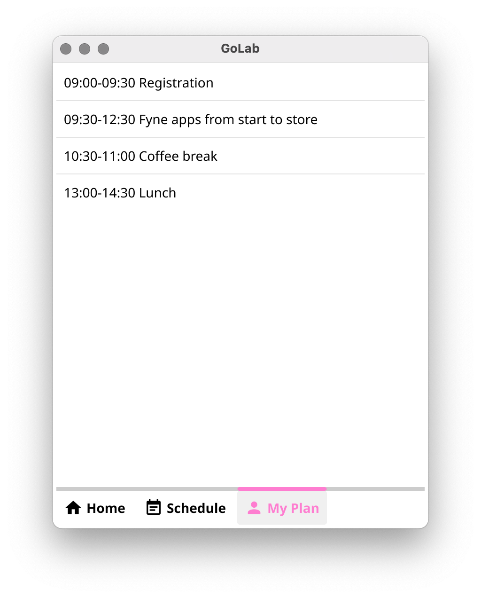

# GoLab

An unoffical app for the GoLab conference

## Running

As long as you have dependencies for building a [Fyne](https://docs.fyne.io/started)
app installed you can simply:

```
git clone https://github.com/andydotxyz/GoLab.git
cd GoLab
go run .
```
## Screenshots






